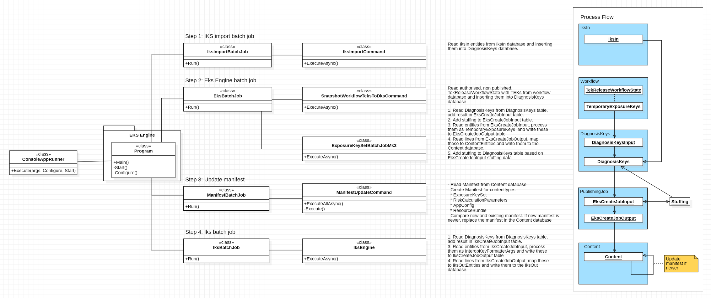
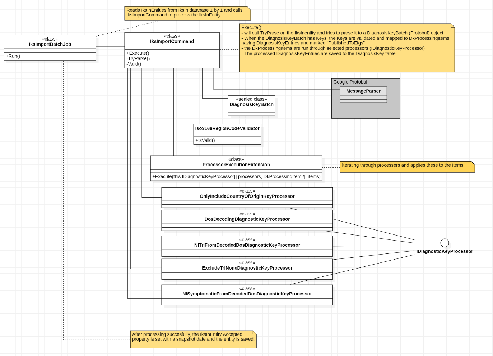
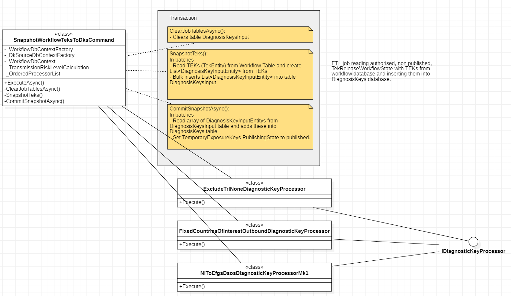
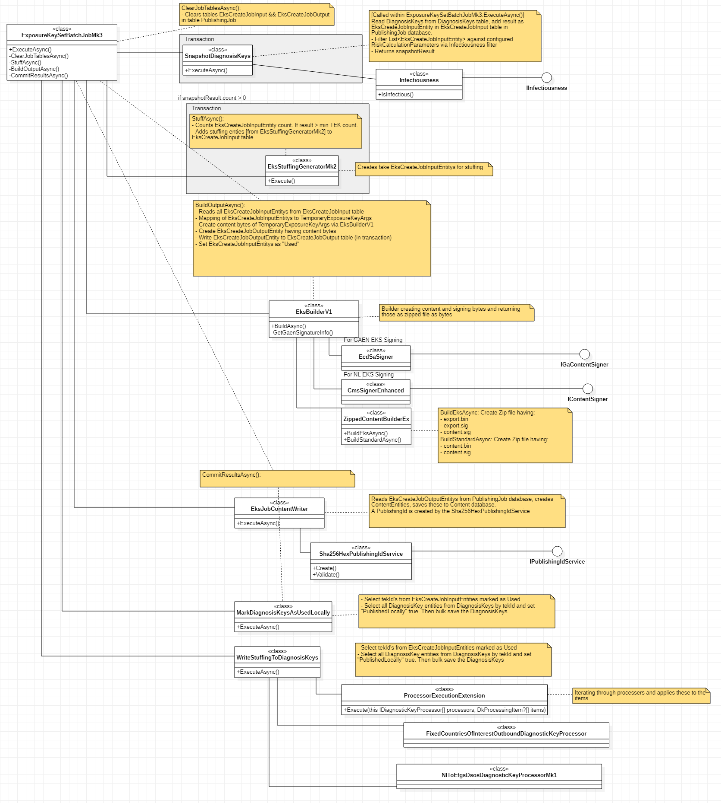
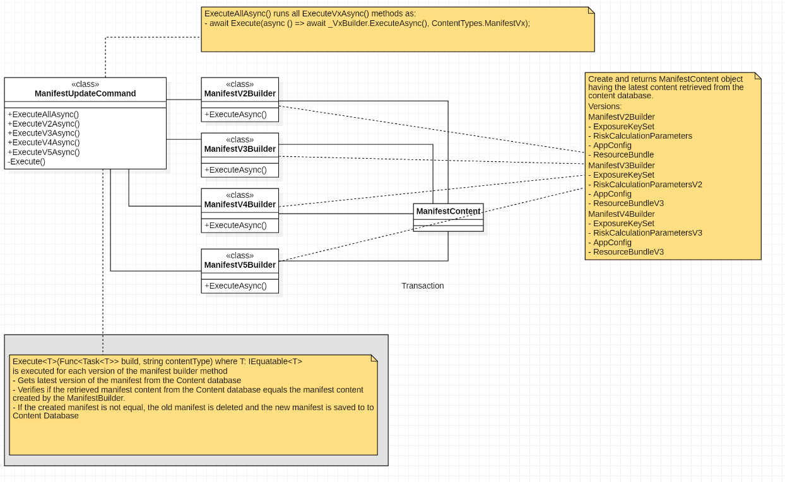
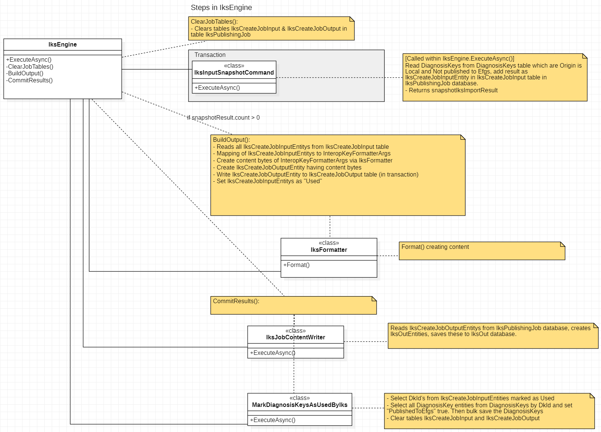

# EKS Engine
The EKS Engine is responsible for publishing authorized (by GGD), unpublished TEKs (Temporary Exposure Keys). The Engine works like a bundle of ETL processes and processes the data step by step in batches. The design describes what these steps are and how they work.

An overview of all the processes handled by the EKS Engine:


The EKS Engine runs using the ConsoleAppRunner.

All steps are executed as commands using the [command pattern](https://www.dofactory.com/net/command-design-pattern).

## The EKS Engine steps:
---
### Step 1. Run the IKS Import batch job
TEKs received from EFGS (international TEKs) will be stored in de IksIn database. This step starts a job that will read those TEKs and add them in the  DiagnosisKeys database. This database also has the local TEKs ready to be published.



This job executes 3 steps.
1. Get (EFGS) entities from the `IksIn` database one by one by this condition:
``` csharp
Where(x => x.Content != null && x.Accepted == null && !x.Error)
```
2. For each entity the `IksImportCommand` is called which performs the following steps:
   1. The conversion from the EFGS formatted key (`Google.Protobuf`) to the local formatted entity (`DiagnosisKeyEntity`)
   2. Run the configured processers on each entity
   3. Add all keys from an entity in the `DiagnosisKeys` database
3. Set `Accepted` on each `IksInEntity` with a snapshot date and save it.
 
---
### Step 2.1. Make a snapshot of the workflow TEKs and add these to the DiagnosisKeys database
The workflow database holds the set of Temporary Exposure Keys received from all mobile devices. This step prepares these keys to be published to all mobile devices again after being authorized by the GGD.
 


The `SnapshotWorkflowTeksToDksCommand` gets TEKs from the workflow to the diagnosiskeys in these 3 steps:
- ClearJobTablesAsync()
- SnapshotTeks()
- CommitSnapshotAsync()

### ClearJobTablesAsync()
Clears the `DiagnosisKeysInput` table in the `DiagnosisKeys` database

### SnapshotTeks()
Gets data from the `TemporaryExposureKeys` table in the `Workflow` database to the `DiagnosisKeysInput` table in the `DiagnosisKeys` database by this condition:
  
``` csharp
.Where(x => x.Owner.AuthorisedByCaregiver != null
                            && x.Owner.StartDateOfTekInclusion != null
                            && x.PublishingState == PublishingState.Unpublished
                            && x.PublishAfter <= snapshot
                            && x.Owner.IsSymptomatic.HasValue
```
_This process is done in batches with a count of max 10000 TemporaryExposureKeys. This is a hardcoded value._

_The owner is the entity in the TekReleaseWorkflowState having TEKs_

While mapping TEKs to DiagnosisKeys, the `dsos`  value is set using this method:
```  csharp
public static int DaysSinceSymptomOnset(this int value, DateTime dateOfSymptomsOnset) =>
            Convert.ToInt32(Math.Floor((value.FromRollingStartNumber().Date - dateOfSymptomsOnset).TotalDays));
```

### CommitSnapshotAsync()
This step starts a couple of processes.

1. Read records from DiagnosisKeysInput in batches of 10000 rows
2. Map thes entities as `DkProcessingItem` and run the configured processers from `IDiagnosticKeyProcessor[]`. Then write the entities to the `DiagnosisKeys` table in the `DiagnosisKeys` database.
3. Read TEKs from Workflow which are added to `DiagnosisKeys` and set `PublishingState` to _Published_

---

### Step 2.2. Publish Exposure Key Sets
All TEKs from the DiagnosisKeys database will be processed and filtered. The result of this are Exposure Key Sets which will be signed and published in the Content database.


This job executes 5 steps:
- ClearJobTablesAsync()
- Execute SnapshotDiagnosisKeys
- StuffAsync()
- BuildOutputAsync()
- CommitResultsAsync()

### ClearJobTablesAsync()
Clears the `EksCreateJobInput` and `EksCreateJoboutput` table in the `PublishingJob` database

### Execute SnapshotDiagnosisKeys
This steps call the `SnapShotDiagnosisKeys` `ExcecuteAsync()` method retrieving entities from the `DiagnosisKeys` table by the following condition:
``` csharp
.Where(x => !x.PublishedLocally && (!x.ReadyForCleanup.HasValue || !x.ReadyForCleanup.Value)) // not PublishedLocally or ReadyForCleanup not set or false
```
This is followed by filtering the retrieved entities and writing the filtered result to the `EksCreateJobInput` table.

_This process is done in batches with a count of max 10000 TemporaryExposureKeys. This is a hardcoded value._

- The filtering filters the diagnosiskeys by infectiousness based on the hardcoded `RiskCalculationParameters` (RCP). The filtering handles both Symptomatic and Asymptomatic diagnosiskeys by a specific RCP.
- All records that are filtered out of the set are marked for Cleanup and will be deleted by the DailyCleanup job. 

### StuffAsync()
For privacy reasons the published keys will be real keys and fake keys so it's not possible to identify the source of an infection by a key. Currently the minimum set of keys is 150. If there are less real keys, the key set will be filled with fake keys to have a total of 150 in a set.
 
In this step the number entities existing in the `EksCreateJobInput` is counted and when the result is below the minimum (currently 150) addition fake enitities (stuffing) is generated using the `EksStuffingGeneratorMk2`
This stuffing entities aRE also added to the `EksCreateJobInput` table.

### BuildOutputAsync()
This step reeads all EksCreateJobInputEntitys from the EksCreateJobInput table and maps the EksCreateJobInputEntitys to TemporaryExposureKeyArgs. 
The EksBuilderV1 is called to create and Zip content files out of TemporaryExposureKeyArgs 
- Create NL sig (content.sig)
- Create Gaen sig (export.sig)
- Create ProtoBuf data (export.bin)

The zipped bytes are added to a EksCreateJobOutputEntity this is the written to the EksPublishingJob table (in transaction).
Finally the EksCreateJobInputEntitys are marked as "Used"

### CommitResultsAsync()
In this last step the EksCreateJobOutputEntities are retrieved from the EksPublishingJob table and mapped to ContentEntities using the EksJobContentWriter. The ContentEntities are written to the Content database (in transaction).

First the EksJobContentWriter is called. It retrieves EksCreateJobOutputEntities from the PublishingJob database and maps the data to ContentEntities as `ExposureKeySets`. Each ContentEntity gets a unique PublishingId which is a hash based on the content it has.

Second all DiagnosisKeys that are published as EKS to the Content database will be marked 'PublishedLocally' is true.

Third all created stuffing will be written to the DiagnosisKeys database.

_The documentation doesn't tell why this third step is done but probably it's to have a set to export to EFGS thats 100% the same as the local set so it's not possible to determine which keys are fake and which keys are real based on the difference between the local published keys and keys send to EFGS._

---
### Step 3. Update Manifest

The ManifestUpdateCommand calls a private `Execute` with a Builder Task for each version of the manifest.
Within each Task these steps will be processed:
- Gets latest version of the manifest from the Content database
- Verifies if the retrieved manifest content from the Content database equals the manifest content created by the ManifestBuilder.
- If the created manifest is not equal, the old manifest is deleted and the new manifest is saved to to Content Database

---
### Step 4. IksEngine
All TEKs from the DiagnosisKeys database will be processed. The result of this are IksOutEntities which willpublished in the IksOut database.

This job executes 4 steps:
- ClearJobTables()
- Execute IksInputSnapshotCommand
- BuildOutput()
- CommitResults()

### ClearJobTables()
Clears the `IksCreateJobInput` and `IksCreateJoboutput` table in the `IksPublishingJob` database

### Execute IksInputSnapshotCommand
This steps call the `IksInputSnapshotCommand` `ExcecuteAsync()` method retrieving entities from the `DiagnosisKeys` table by the following condition:
`.Where(x => !x.PublishedToEfgs)`

_This process is done in batches with a count of max 10000 TemporaryExposureKeys. This is a configurable value._

There is no filtering applied on `RiskCalculationParameters` (RCP) like this is done with local TEKs

### BuildOutput()
- Reads all IksCreateJobInputEntitys from IksCreateJobInput table
- Mapping of IksCreateJobInputEntitys to InteropKeyFormatterArgs
- Create content bytes of InteropKeyFormatterArgs via IksFormatter
- Create IksCreateJobOutputEntity having content bytes
- Write IksCreateJobOutputEntity to IksCreateJobOutput table (in transaction)
- Set IksCreateJobInputEntitys as "Used"

### CommitResults()
1. Reads IksCreateJobOutputEntitys from IksPublishingJob database, creates IksOutEntities, saves these to IksOut database.
1. - Select DkId's from IksCreateJobInputEntities marked as Used
   - Select all DiagnosisKey entities from DiagnosisKeys by DkId and set "PublishedToEfgs" true. Then bulk save the DiagnosisKeys 
   - Clear tables IksCreateJobInput and IksCreateJobOutput