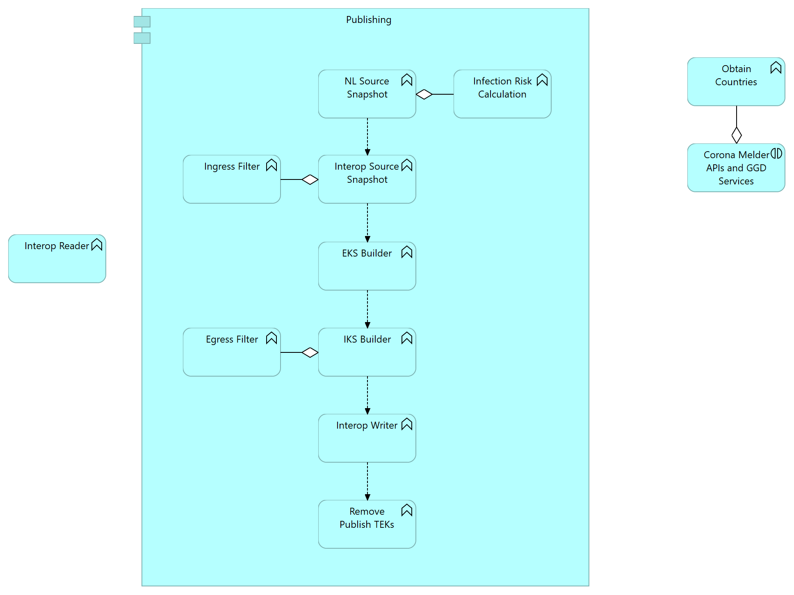

# International Interoperability: Technical Design

**Version**: 0.2, 3 september 2020

**Status**: Draft

**Authors**: 

* Ryan Barrett
* Steve Kellaway
* ..

# Introduction

This document contains the Software Architecture and Design for the Corona Melder backend support of the European Federated Gateway Server (EFGS) which implements the EU Interoperability.

Please see the solution architecture document for a detailed description of Interoperability, the business requirements and a high level overview of the System Architecture.

# Contents

- Phase One
  * Overview
  * Operations
  * Database
    - Interop.TemporaryExposureKeys
    - Interop.DiagnosisKeys
    - Interop.IncomingBatchJobs
    - Interop.OutgoingBatchJobs
	- Workflow: TemporaryExposureKeys
    - Workflow: TekReleaseWorkflowState
    - Workflow: vwTemporaryExposureKeys
    - Workflow: vwTekReleaseWorkflowState
  * New Components
	- Entities
    - InteropKeySetEngine (IksEngine)
    - Interop Downloader
    - Interop Uploader [TODO]
  * Existing Components
    - EKS Stuffing Generator
    - GGD Portal Backend
    - GGD Portal Frontend
    - EKS Engine [TODO]
  * Appendix
    - ISO Codes
    - Additions for Functional Requirements

# Phase One

In the first phase of interop our aim is to share out keys with EFGS and download keys from other countries from EFGS and integrate them into our keysets. This first phase will involve only changes to the backend, with no changes required in the apps.

## Overview

This high level overview shows the main components, data (grey) and external systems (orange).

Interoperability places a different set of constraints on the server so some functionality will be moved. This helps to simplify the design of the system, reducing the number of concepts, runtime artifacts and tables.

The design is based on standard Software Engineering practises. This leads the design to use a staging process to separate raw and production data; as well as to keep these processes separated for the existing NL server and the new interop dataflows.


The take-away from this diagram is that with some minor changes to the server we can treat Interop as a logical mirror of our normal flow.

### Publishing flow

This diagram shows how the publishing components are to be executed. The take-away from this is the requirement for the process to run sequentially. This is a simplication of the initial design made to reduce complexity given the constraints of our runtime infrastructure.



## Operations

The interoperability components will run on a dedicated server (`-interop`) and will store data in a dedicated database.

## Database

For interop we will have a new database, called `Interop`.

### Interop: TemporaryExposureKeys (new)

This is a staging table, it holds the incoming TEKs from the EFGS. It mirrors the table `Workflow.TemporaryExposureKeys` from the NL server.

```
CREATE TABLE [dbo].[TemporaryExposureKeys] (
	[Id] [bigint] IDENTITY(1,1) NOT NULL,
	[IncomingBatchJobId] [bigint] NOT NULL,
	[KeyData] [varbinary](32) NOT NULL,
	[RollingStartNumber] [int] NOT NULL,
	[RollingPeriod] [int] NOT NULL,
	[Origin] [varchar](2) NOT NULL,
	[CountriesOfInterest] [varchar](MAX) NOT NULL,
	[OriginTransmissionRiskLevel] [int] NOT NULL,
	[TransmissionRiskLevel] [int] NOT NULL,
	[ProcessingState] [int] NOT NULL,
	CONSTRAINT [PK_TemporaryExposureKeys] PRIMARY KEY CLUSTERED 
	(
		[Id] ASC
	)
)
```

### Interop: DiagnosisKeys (new)

This table holds fully cleaned, validated, stuffed and valid keys from all sources (NL & EU Federation Gateway). This table is the source of truth for the *EksEngine* and *InteropPubishingEngine*.

Keys stored in this table will always be published to an EKS (Exposure Key Sets) AND to IKS (Interop Key Sets). Keys which are not to be distributed are published to the ϵ sets. Note: keys with TRL of none will never be added to the DiagnosisKeys table.

Once published to both destinations keys are deleted from this table.

```
CREATE TABLE [dbo].[DiagnosisKeys] (
	[Id] [bigint] IDENTITY(1,1) NOT NULL,
	[KeyData] [varbinary](32) NOT NULL,
	[RollingStartNumber] [int] NOT NULL,
	[RollingPeriod] [int] NOT NULL,
	[Origin] [varchar](2) NOT NULL,
	[CountriesOfInterest] [varchar](MAX) NOT NULL,
	[TransmissionRiskLevel] [int] NOT NULL,
	[PublishedToEksOn] [datetime] NULL,
	[PublishedToInteropOn] [datetime] NULL,
    [IsStuffing] [bit] NOT NULL
	CONSTRAINT [PK_DiagnosisKeys] PRIMARY KEY CLUSTERED 
	(
		[Id] ASC
	)
)
```

### Interop: IncomingBatchJobs (new)

This is the worklow table for incoming batches. It has a FK to `Interop.TemporaryExposureKeys` so batches are linked.

```
CREATE TABLE [dbo].[IncomingBatchJobs] (
	[Id] [bigint] IDENTITY(1,1) NOT NULL,
	[CreatedOn] [datetime] NOT NULL DEFAULT(GETDATE()),
	[StartedOn] [datetime] NULL,
	[CompletedAt] [datetime] NULL,
	[Status] [int] NOT NULL DEFAULT(0),
	[RetryCount] [int] NOT NULL DEFAULT(0),
	[CompletionToken] [nvarchar](max) NULL,
	[TotalKeys] [int] NULL,
	[TotalCountries] [int] NULL,
)
```

### Interop: OutgoingBatchJobs (new)

This is the worklow table for outgoing batches.

```
CREATE TABLE [dbo].[OutgoingBatchJobs] (
	[Id] [bigint] IDENTITY(1,1) NOT NULL,
	[CreatedOn] [datetime] NOT NULL DEFAULT(GETDATE()),
	[StartedOn] [datetime] NULL,
	[CompletedAt] [datetime] NULL,
	[Status] [int] NOT NULL DEFAULT(0),
	[RetryCount] [int] NOT NULL DEFAULT(0),
	[TotalKeys] [int] NULL
)
```

### Interop: InteropKeySets (new)

This is the worklow table for the InteropKeySets.

```
CREATE TABLE [dbo].[InteropKeySet] (
    [Id] INT IDENTITY (1, 1) NOT NULL,
    [Created] DATETIME2 (7) NOT NULL,
    [Content] VARBINARY (MAX) NOT NULL
    CONSTRAINT [PK_InteropKeySet] PRIMARY KEY CLUSTERED ([Id] ASC)
)
```

### Workflow: TemporaryExposureKeys

- Remove the field 'Region'.

### Workflow: TekReleaseWorkflowState

- Add the field `CountriesOfInterest` as a `varchar(255) NOT NULL` and `DEFAULT ('NL')`.

### Workflow: vwTemporaryExposureKeys

- Remove the field `Region`.

### Workflow: vwTekReleaseWorkflowState

- Add the field `CountriesOfInterest`.

## New Components

The interop server functionality will be implemented as a number of extra commands and components within the existing server.

### InteropKeySetEngine (IksEngine)

This component generates EKS from keys in the table `Interop.DiagnosisKeys` which have the `Origin` of `NL`, where `PublishedToEksOn` is not null and `PublishedToInteropOn` is null. The keysets are then stored in the table `Interop.InteropKeySets`.

Almost all of the patterns in this tool are re-used from the `EksEngine`.

The `egress filter` is implemented in this component.

Conceptually it is the mirror of the EksEngine.

### Interop Downloader

This component is responsible for downloading the keys from the interop server and putting them in the table `Interop.TemporaryExposureKeys`. It supports the batching logic of the EU Federation gateway.

It applies the same validation rules as postkeys (via re-use), dropping any keys which we do not consider valid.

#### Interop Web Api

This web api is a website which hosts the web services we need to expose to support the EFGS.

#### Register callback (RegisterInteropCallbackCommand)

The EU federation gateway implements a callback functionality to notify the backend that there are new keysets available. The interop downloader will initally register our callback url with the EFGS.

The gateway implements a CRUD interface over callbacks, which can be found here: https://github.com/eu-federation-gateway-service/efgs-federation-gateway/blob/master/src/main/java/eu/interop/federationgateway/controller/CallbackAdminController.java

The command will first check to see if our callback is registered by calling `getCallbackSubscriptions`. If this does not return our callback then 

The callback will be configurable, with the following options:

- `federationGatewayBaseUrl`
  * the base url for EFGS.
  * e.g. : `https://someurl/something`
- `callbackId`
  * our free-text identifier for our callback.
  * e.g. `2020-09-05_Prod`
- `callbackUrl`
  *  our callback url, a full URL.
  * e.g. `https:/coronamelder-api.nl/v1/efg-callback`
- DB settings

More details on callbacks can be found here: https://github.com/eu-federation-gateway-service/efgs-federation-gateway/blob/master/docs/implementation_details/callback.md

#### Callback handler (HandleInteropCallbackCommand)

The handler will be called once per batch job published by the EFGS. The gateway will retry the callback until we return a success.

We must process every batch which is published to interop.

This command will accept the callback, write it to the database table `Interop.IncomingBatchJobs` and then return an OK once the transaction has committed.

The callback is an empty `GET` to our callback url, with the query parameters `batchTag`and `date`. These will be stored in `Interop.IncomingBatchJobs` in the fields `BatchTag` and `BatchDate` respectively.

The handler implementation can be found here: `https://github.com/eu-federation-gateway-service/efgs-federation-gateway/blob/master/src/main/java/eu/interop/federationgateway/service/CallbackTaskExecutorService.java`

#### Batch downloader (InteropBatchDownloaderCommand)

This command will download the batches found in the table `Interop.IncomingBatchJobs` one for one. It will download the data, deserialize it and then put the content into the table `Interop.TemporaryExposureKeys`.

The keys will be validated using a subset of our validation rules:
- <TODO details>

Each batch will be processes once and once only. To ensure that this happens an exclusive row-level lock will be held on each batch as it is being processed. This can be implemented by selecting the ID of the single batch ID under the `serializable` transaction isolation level. That can be achieved via the hint `HOLDLOCK` or by setting the isolation level correctly on the context.

Once a batch has been processed the status will be changed to `BatchStatus.Downloaded`.

Conceptually it is the same as /postkeys from the Mobile API.

#### Process batches (InteropBatchProcesserCommand)

This component is responsible for taking raw keys from the table `Interop.TemporaryExposureKeys`, implementing the `Ingress Filter` and then copying the keys which pass the filter to the table `Interop.DiagnosisKeys`. Once the keys are copied they will be removed from `Interop.TemporaryExposureKeys` (as part of the same transaction).

Conceptually this is the same as the first part of the existing EksEngine.

This command will iterate through all of the downloaded batched of status `Downloaded`.

First the keys for the batch will be loaded from `Interop.TemporaryExposureKeys` and we will apply our *ingress filter* them. The filter consists of the following checks:
- TODO
- TODO

Keys which pass the filter will be inserted into the table `Interop.DiagosisKeys` and marked as processed. Those that failed will be marked as processed and the details logged.

Once the batch is complete the batch status will be uploaded to `BatchStatus.Processed` and all of the processed keys from that batch will be deleted from the table `Interop.TemporaryExposureKeys`. The numbers being logged.

Once all of the batches have been processed then they will be removed from the table `IncomingBatchJobs`. The numbers and details logged.

The following settings will be added:
- TODO
- TODO

### Interop Uploader (TODO: finish)

			This component is responsible for uploading published TEKs - both real and stuffing - to the EFGS. The tool takes the unpublished IKS from ContentDb and uploads them one-by-one and only once to the EU Federation server.

			The upload accepts a protocol-buffer format keyset: https://github.com/eu-federation-gateway-service/efgs-federation-gateway/blob/master/src/main/proto/Efgs.proto.

			The file is then uploaded to: [TODO].

			Conceptually it is the mirror of the ContentApi.

## Existing Components

One of the main design goals for phase one is to minimize the changes to existing components whilst minimizing the impact on our support of the interop standard.

Short summary of changes:
- EKS engine command will be split to allow reuse. Code changes are minimal.
- EKS engine will be modified to use the new tables. Code changess are minimal as schema changes are also minimal.
- EKS engine command will gain an origin-filter
- Some commands may need to be further parameterized so they can be reused for both Iks and Eks engine.

### EKS Stuffing Generator

*Components\ExposureKeySetsEngine\EksStuffingGenerator.cs*

* Add a function `GenerateCountriesOfInterest()` which will randomly choose one or more of the ISO country codes from the list and return that together with our own land code (`NL`).  The list will be weighted such that both the number and chosen countries are similar to actual data.
* Set `EksCreateJobInputEntity.Origin` to `NL`.
* Set `EksCreateJobInputEntity.CountriesOfInterest` to the results of `GenerateCountriesOfInterest()`.

We will always have to stuff to the level of 150 keys with the origin of `NL`. These exact stuffed keys will included in both `EKS` and `IKS`.

### GGD Portal Frontend

The GGD Portal will be modified to allow the GGDs to select the countries visited from a list. 

The design looks like this:

<TODO: insert design>

**app\services\lab-confirm.service.ts**

Add the selected countries to `this.data.CountriesOfInterest` in `confirmLabId`. The countries must be a comma-seperated list in the form: `NL,DE,BE,FR`.

### GGD Portal Backend 

**Components\Workflow\Authorisation\AuthorisationArgs.cs**

- Add `CountriesOfInterest` as a string property.

**Components\Workflow\Authorisation\AuthorisationArgsValidator.cs**

- Add validation for `CountriesOfInterest`, it must be matched by this regex: `^([A-Z]{2},?)+$`.
- The values in the list must be in the ISO-3166-2 country code table.
- `NL` must be included in the list.

**Components\Workflow\Authorisation\AuthorisationWriterCommand.cs**

- Set `wf.CountriesOfInterest = args.CountriesOfInterest` in `Execute()`.

### Cleanup tools which are in development [TODO]

Only delete published TEKs after 14 days.
Update stats so that they take int account the `IsStuffing` flag.

### EksEngine [TODO]

* Insertion of keys from origins other than NL into our Exposure Key Sets.
* We need to add all keys at this point: we shouldn't actually need to change anything in the EKS engine to get that. Only we do have to implement new stuffing requirements, as well as inserting the stuffing into the database AND making sure that nothing is deleded.

**Components\EfDatabase\Entities\TekEntity.cs**

- Remove the property `Region`.

**Components\EfDatabase\Entities\TekReleaseWorkflowStateEntity.cs**

- Add `CountriesOfInterest` as a string property matching this regex `^([A-Z]{2},?)+$`.

# Phase Two

* Make the ISO country codes list dynamic/configurable everywhere.
* Generate an EKS per country.
* Generate a manifest per country.
* Extend the content-api endpoints so we get: `manifest/{ISO-3166-2}`, `exposurekeyset/{ISO3166-2}`.

# Appendix

## ISO 3166-2 Codes

| Code | Country                |
| ---- | ---------------------- |
| XX   | Unspecified / Unknown  |
| NL   | The Netherlands        |
| DE   | Germany                |
| BE   | Belgium                |
| DK   | Denmark                |
| PL   | Poland                 |
| IE   | Ireland                |
| AT   | Austria                |
| ES   | Spain                  |
| IT   | Italy                  |
| CZ   | Czech Republic         |
| EE   | Estonia                |
| LV   | Latvia                 |

Other codes should be added but will not be shared.

## Missing requirements from the `Architecture` document

* In the stuffing, the `Origin` and `Region of Interest` should not be randomized between all regions. Most keys are from NL. It should match the distribution of keys per country (or a set percentage).

* The architecture talks about proving `Region of Interest` per day from the GGDs. That's not workable. Designers have designed this PER Lab Code

* Archtecture talks abount the GGD
